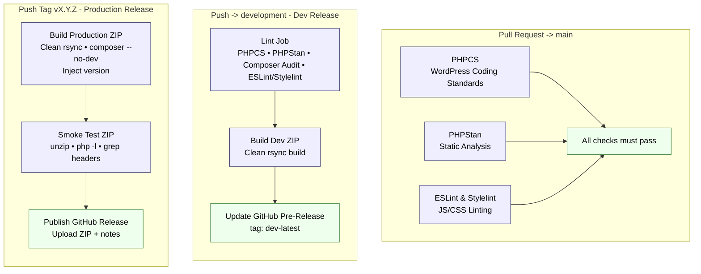

# Availability Calendar for Beds24

A lightweight WordPress plugin that displays a Beds24 room or property availability calendar via the `[avail_calendar]` shortcode.

No jQuery. No build step. No external dependencies beyond the Beds24 availability API.

---

## Features

- **Colour-coded tiles** — green (available), red (unavailable), diagonal split for arrival/departure transition days
- **Locale-aware** — month names, weekday labels, and first day of week adapt automatically to any BCP-47 language tag via the browser's built-in `Intl` API
- **Click-to-book** — available dates link directly to `beds24.com/booking.php` with the correct date, room, and language
- **SessionStorage cache** — 5-minute TTL per room/property, avoids repeated API calls during navigation
- **Dark mode** — respects `prefers-color-scheme`
- **Multiple instances** — each shortcode creates an independent `AvailCalendar` class instance; safe to use several times on the same page

## Example of Display


## Elementor Integration


Note that the number of months can be selected independantly for desktop, tablet, and mobile size.


---

## Installation

1. Download or clone this repository
2. Copy the `availability-calendar-for-beds24` folder to your WordPress installation's `/wp-content/plugins/` directory
3. Activate the plugin via **Plugins → Installed Plugins** in WordPress admin

---

## Shortcode Usage

```
[avail_calendar roomid="12345" nummonths="5" lang="fr"]
[avail_calendar propid="67890" nummonths="3" lang="en"]
```

### Attributes

| Attribute    | Default      | Description                                        |
|--------------|--------------|----------------------------------------------------|
| `roomid`     | —            | Beds24 room ID (use `roomid` OR `propid`, not both)|
| `propid`     | —            | Beds24 property ID                                 |
| `nummonths`  | `5`          | Months to display (1–24)                           |
| `startmonth` | current      | Starting month (1–12)                              |
| `startyear`  | current      | Starting year (2020–2100)                          |
| `lang`       | `en`         | BCP-47 locale, e.g. `fr`, `de`, `es`, `it`, `nl`  |

---

## Architecture

```
availability-calendar-for-beds24/
├── availability-calendar-for-beds24.php   ← Plugin entry point, shortcode, footer init
├── assets/
│   ├── calendar.css                       ← Scoped styles (.bac-wrapper)
│   └── calendar.js                        ← AvailCalendar class
└── readme.txt                             ← WordPress plugin readme
```

### How it works

1. Each `[avail_calendar]` shortcode renders a `<div id="bac-{unique}">` container and registers its config.
2. A single `<script>` block at `wp_footer` instantiates all `AvailCalendar` instances collected during page render.
3. Each instance fetches availability from `media.xmlcal.com`, caches it in `sessionStorage`, and renders the calendar into its own container.
4. CSS and JS are each enqueued once per page regardless of how many shortcodes appear.

### JavaScript class

The `AvailCalendar` class can also be used outside WordPress:

```html
<link rel="stylesheet" href="assets/calendar.css">
<script src="assets/calendar.js"></script>

<div id="my-calendar"></div>
<script>
  new AvailCalendar({
    containerId: 'my-calendar',
    roomid:      12345,
    numMonths:   5,
    lang:        'fr',
  });
</script>
```

---

## Tile Logic

| Today | Yesterday | Result |
|-------|-----------|--------|
| past  | —         | Grey text, no background |
| `0`   | `0` or past | Full red (unavailable) |
| `0`   | `1`         | Green top-left / red bottom-right (AM free, PM taken) |
| `1`   | `1` or absent | Full green (available) |
| `1`   | `0`         | Red top-left / green bottom-right (AM taken, PM free) |

---

## CI/CD Pipeline




---

## Privacy

- Availability data is fetched **directly in the visitor's browser** from `media.xmlcal.com`. No data passes through your WordPress server.
- The Beds24 `roomid`/`propid` is visible in browser network requests and in booking URLs. This is inherent to the Beds24 API and consistent with the official Beds24 widget.
- No personal data is collected. `sessionStorage` cache is cleared automatically when the browser tab is closed.

---

## License

GPLv2 or later © Jacques Leisy

This plugin is free software; you can redistribute it and/or modify it under the terms of the [GNU General Public License v2](https://www.gnu.org/licenses/gpl-2.0.html) or later.
